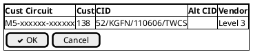
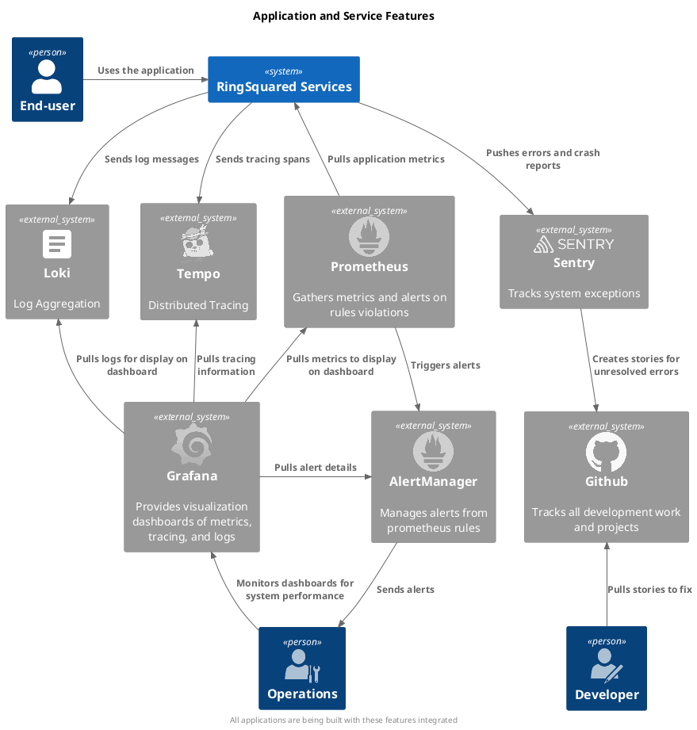

<!--

**Content.**

This section describes overall, principal regulations and solution ideas
that are relevant in multiple parts (= cross-cutting) of your system.
Such concepts are often related to multiple building blocks. They can
include many different topics, such as

  - domain models

  - architecture patterns or design patterns

  - rules for using specific technology

  - principal, often technical decisions of overall decisions

  - implementation rules

**Motivation.**

Concepts form the basis for *conceptual integrity* (consistency,
homogeneity) of the architecture. Thus, they are an important
contribution to achieve inner qualities of your system.

Some of these concepts cannot be assigned to individual building blocks
(e.g. security or safety). This is the place in the template that we
provided for a cohesive specification of such concepts.

**Form.**

The form can be varied:

  - concept papers with any kind of structure

  - cross-cutting model excerpts or scenarios using notations of the
    architecture views

  - sample implementations, especially for technical concepts

  - reference to typical usage of standard frameworks (e.g. using
    Hibernate for object/relational mapping)

**Structure.**

A potential (but not mandatory) structure for this section could be:

  - Domain concepts

  - User Experience concepts (UX)

  - Safety and security concepts

  - Architecture and design patterns

  - "Under-the-hood"

  - development concepts

  - operational concepts

Note: it might be difficult to assign individual concepts to one
specific topic on this list.

-->

## Domain Concepts

* 

* 

* 

* 

* 

* 

## User-Experience (UX)

## Operational Concepts

The service interacts with several external systems to provide observability into the performance of the system.

**Loki**
: Centralized logging system from Grafana.  The application logs to stdout and the underlying operating system then uses promtail to forward the logs to Loki.  Promtail can be run standalone on servers or as a sidecar for kubernetes and docker containers.

**Tempo**
: Distributed tracing system from Grafana.  This system is able to receive traces written for various telemtry systems including OpenTelemetry, Zipkin, and Jaeger.  We use OpenTelemetry to send the traces and spans.

**Prometheus**
: Metrics gathering system.  Each service is written to expose metrics pertaining to the service.  Nodes, databases, kubernetes, queing systems, etc also expose metrics that are gathered by Prometheus.  Alerting rules can be defined based on the collected metrics.

**AlertManager**
: Alerts triggered in Prometheus are forwaded to AlertManager where they can be deduplicated, queued,  and evaluated sending notifications.  AlertManager has the ability to send notifications via Slack, Teams, SMS, email, and a variety of other methods.

**Grafana**
: Grafana provides a centralized place to view dashboards that correlate metrics, logs, traces, and alerts.  

**Sentry**
: Crashes and unexpected errors are forwarded to Sentry.  There they are collected, alerts sent out, and issues created in Github for further exploration.

